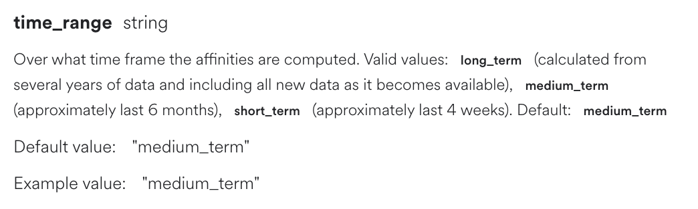
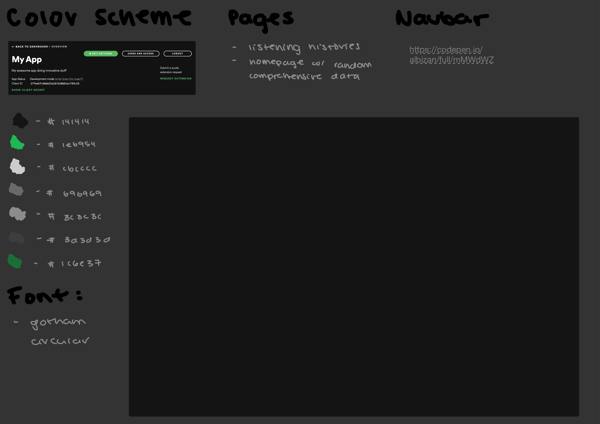
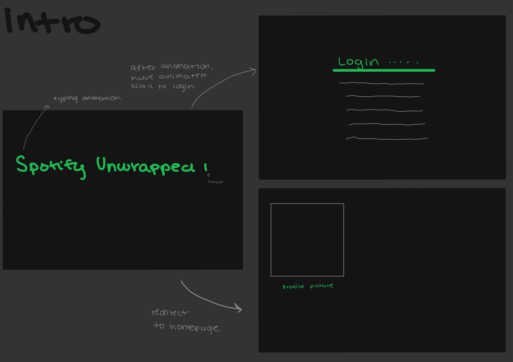
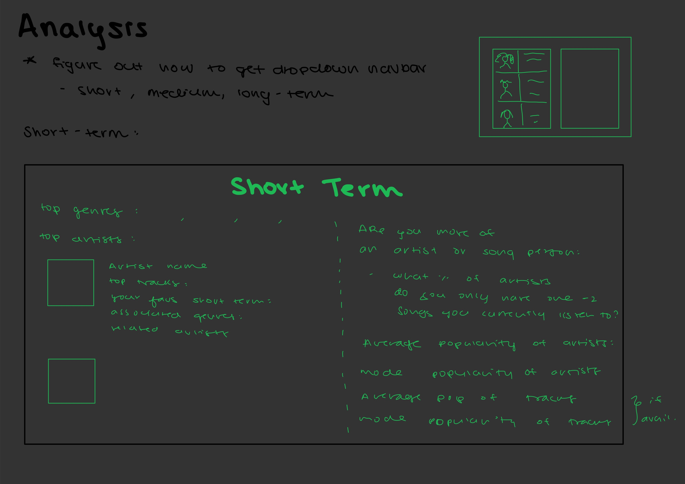

# Design Document

## Overview
My project is a simpler version of `Spotify Wrapped`. It will use the Spotify API to analyze a user's music over recent and less recent time periods, and then for all time. It will perhaps offer a quiz at the beginning  and some recommendations at the end.

&nbsp;
### Why this App

I love listening to various types of music! I wanted to make an app where I could view my listening data for a ***very** long time, but didn't know where to begin. `JavaScript`, which I found quite difficult to parse, was too intimidating. When I discovered `Flask`, I still had no idea `Jinja` existed.

My CS50 final felt like the opporunity to attempt this app!

&nbsp;
### Goals
You can find the outcomes at the end of this document or in README.md

- Good Outcomes: 
    - Analyzing my own spotify data with pages on listening history in recent and longer time spans, then also all time. 

- Better Outcomes: 
    - Allowing for users to authorize the site to use their spotify data or perhaps pass it in as a file. 
    - Creating a guessing game based off of their listening histories.


- Best Outcome:
    - Having a recommendation feature for songs/artists 
    - Creating a (decently) aesthetically pleasing interface.

&nbsp;
## Implementation: Data
### 'Short', 'Medium', and 'Long Term'
- Spotify returns data for user activity with 3 time ranges. Refer to [Spotify's docs](https://developer.spotify.com/documentation/web-api/reference/#/operations/get-users-top-artists-and-tracks) for more information.

    - 

&nbsp;
### Credentials
I used 3 client credentials to access the `Spotify` API: a `client secret`, `client id`, and a `redirect uri`
> Note: the port value used for this app's `redirect uri` is `5002` since some versions of MacOS [block API calls](https://stackoverflow.com/questions/69818376/localhost5000-unavailable-in-macos-v12-monterey?noredirect=1&lq=1) for `5000` since it is being used by the system for an AirPlay feature . I worked with a TF to change the port number.

&nbsp;
## Implementation: Technology
### Flask
- I have very little experience with web development. Using `Python` and `Jinja` instead helped me focus on the actual functionality of the app rather than learning a foreign language.
- My main `Flask` app is called `main.py` each function, which has several funtions that render `Jinja` templates with user data

&nbsp;
### Spotipy
- I used the [Spotipy](https://spotipy.readthedocs.io/en/2.19.0/#) API, which is a Python wrapper for the regular [Spotify]https://developer.spotify.com/documentation/web-api/) API, to get user data. It has all the functionality of the regular API.
- almost all of my functions, both in `main.py` and `helpers.py` use `Spotipy`

### HTML, CSS,Bootstrap
- I am **extremely** proud of my final designs for my website. They not only required SO much time and research, but also required me to structure my data to work best with `Bootstrap`
- I largely recycled knowledge I learned from class, but the styling of the page remained the second-most difficult task for this project. 
- I improved most on: 
    - centering columns
    - specifying the correct margin/padding values
    - importing a font similar to the one Spotify uses
- I also had a TREMENDOUSLY difficult time learning how to style my page aesthetically. Below are some of my original wireframes:
    - 
    - 
    - 

&nbsp;
&nbsp;
## Displaying and Structuring API data
- all of my code follows the same format. Route requests are sent to `main.py`, which calls any relevant functions in `helpers.py` to get data to render a `Jinja` template with.

- Example: Getting a user's track history
    - I wanted to display each track's name and artist in a grid. This required formatting the data passed into the `Jinja` template as rows. `main.py` calls a function in `helpers.py` called `get_track_grid` to do this:

        ``` python
        def get_track_grid(results):

        # to create track grid, hands html track data as a list of lists, with each list having a dict of 4 tracks in it

        '''
        ex: 
        [
            [{track_data}, {track_data}, {track_data}, {track_data}],
            [{track_data}, {track_data}, {track_data}, {track_data}],
            [{track_data}, {track_data}, {track_data}, {track_data}],
            [{track_data}, {track_data}, {track_data}, {track_data}]
        ]
        '''
        ```
    - It was highly difficult to index through responseses for each call to `Spotipy`.  Returning this formatted data was especially helpful for extracting the pieces I needed for the `track grid`
        ``` python

        for idx, track in enumerate(results['items']): # from what I understand, need index as a placeholder for key ( enums are key-value pairs), track as value
            track_name = track['artists'][0]['name'] + " – " + track['name']
            track_link = track['external_urls']['spotify'] # used as unique identifier
            image_link = track['album']['images'][0]["url"]
            artist_name = track['artists'][0]['name'] # I think it currently only gets one artist name even if there are many

            # inserts data into track
            current_track = dict()
            current_track = {"track_name": track_name, "track_link": track_link, "artist_name" : artist_name, "image_link": image_link}
            current_row.append(current_track)

            if col_count == num_cols:
                track_data.append(current_row)
                current_row = []
                col_count = 1
                row_count +=1

            elif num_rows == row_count and col_count == remainder_cols: # if on the last row and the last track, append row to list
                track_data.append(current_row)
                break
            else:
                col_count+=1

        return track_data
        ```
        >   Note: These are just snippets of the function I find relevant. 
    - `main.py` called this function for the `track history` page of the app, making the Flask code much more elegant and easy-to-read:

        ``` python
        @app.route("/history")
        # @login_required
        def history():

        
            # requests client's top tracks and lists them out w/ link
            # can change time_range param to short_term (past 4 weeks) or middle_term (default, past 6 months)
            # ex: results = sp_obj.current_user_top_tracks(time_range= "short_term")
            
            short_term_data =  sp_obj.current_user_top_tracks(limit = 8, time_range= "short_term") # refer to docs/sample_top_tracks.json for sample output
            medium_term_data = sp_obj.current_user_top_tracks(limit = 8)
            long_term_data = sp_obj.current_user_top_tracks(limit = 8, time_range= "long_term")
            
            # flask passes in track data in format of a grid: as a list of lists, with each list having a dict of 4 tracks in it (refer to helpers.py for more details)

            return render_template("history.html", short_term_tracks = get_track_grid(short_term_data), medium_term_tracks = get_track_grid(medium_term_data), long_term_tracks = get_track_grid(long_term_data)) # don't need to specify that index.html is in templates folder as render_templates automatically assumes its in there
        ```


&nbsp;

&nbsp;
## Outcomes:
## Home: 
Home is an informational page with details on what my project does, why I chose to develop it, and more. 

## Prediction Game:
A quick trivia form before the user gets into the analysis. 
    - Enter number and words into each mini quiz and press `submit`  to guess the user's listening habits. 
    - The input fields will turn green or red depending on whether you are correct or not.

## Track History:
Navigate to this page and it will display the user's top songs in the short, middle, and long term (of all time). 

## Recommendations
This page generates song recommendations based from random genres or danceability levels, top artists or tracks. 
Click on a button to get random songs. If you refresh the page, the recommendations will automatically regenerate with recommendations based on the top artists.

## Analysis
More complex analysis of artists to balance out `Track History` page. Click on links to navigate to an artist or song. Note that some green text is simply bolded

## Log in
Having users log into their accounts was much more difficult than I anticipated. There was little code I could reference, especially for Flask. I attempted to use the following extensions to make it easier, but getting them to work was clearly outside of my scope of knowledge. 

I wish this feature worked, but am still glad I achieved my core goal; displayinf and analyzing my **own** data.

