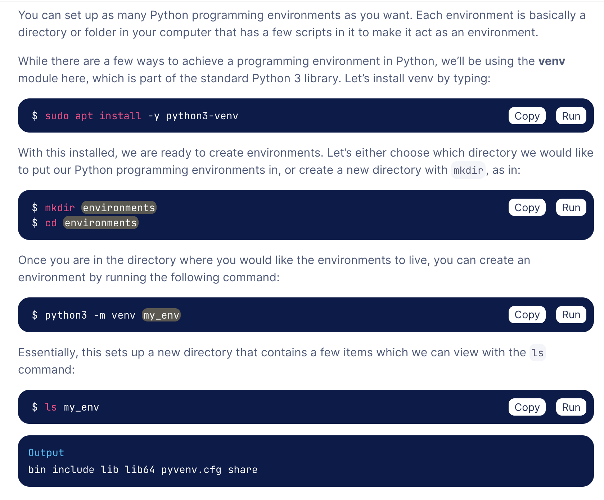

# Information
**Article link:** https://www.digitalocean.com/community/tutorials/how-to-make-a-web-application-using-flask-in-python-3#introduction

# Making a Virtual Environment
* Really helpful in general, just including it here since it is a requirement for the project. Need to have a venv in the actual flask_blog folder

#homebrew install is in fifi's macbook air - > macintosh hd - > opt 